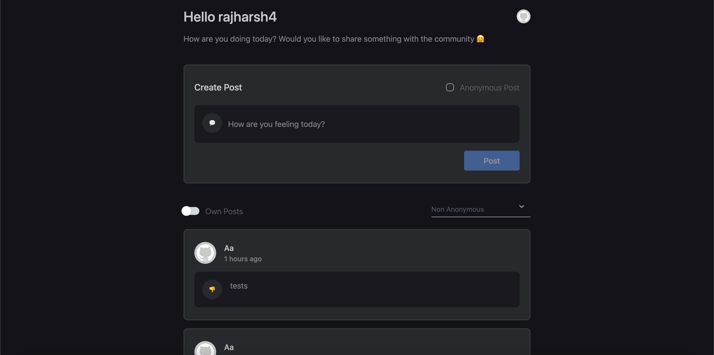
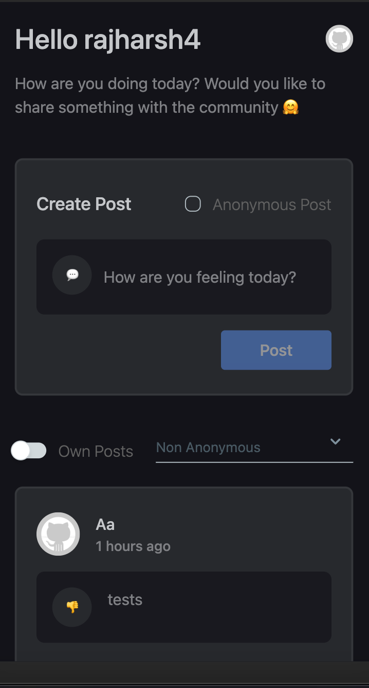

# ForumApp

 

## Table of Contents

- [ForumApp](#ForumApp)
  - [Table of Contents](#table-of-contents)
  - [Tech Stack](#tech-stack)
    - [Backend:](#backend)
    - [Frontend](#frontend)
  - [Getting Started](#getting-started)
    - [Backend](#backend-1)
    - [Frontend](#frontend-1)
  - [API Endpoints](#api-endpoints)

## Tech Stack

### Backend:

- Node.js
- Express.js
- MongoDB

### Frontend

- React
- TailwindCSS
- material-tailwind/react

## Getting Started

1. You can run the below command which would install the packages simultaneously for both client and server:

```
npm run install
```

2. Start the backend server:

```
npm run start:backend:dev
```

3. Start the frontend app:

```
npm run start:frontend:dev
```

4. Frontend application should be up at: http://localhost:3000/ and backend server should be up at http://localhost:2000/

## API Endpoints

| Method | Endpoint                  | Description                              |
| ------ | ------------------------- | ---------------------------------------- |
| GET    | `/api/users/me`           | Retrieve current user Profile            |
| POST   | `/api/auth/register`      | Registering a new user                   |
| POST   | `/api/auth/login/`        | Login for registered user                |
| GET    | `/api/auth/logout/`       | Logout for current user                  |
| DELETE | `/api/posts/:postId/`     | Delete a specific post                   |
| POST   | `/api/posts/create`       | Create a new post                        |
| GET    | `/api/posts`              | Retrieve all Posts                       |
| GET    | `/api/posts/user/:userId` | Retrieve all posts for a particular user |
| GET    | `/api/posts/:postId`      | Retrieve a specific post                 |
| PATCH  | `/api/posts/:postId`      | Update a specific post                   |
